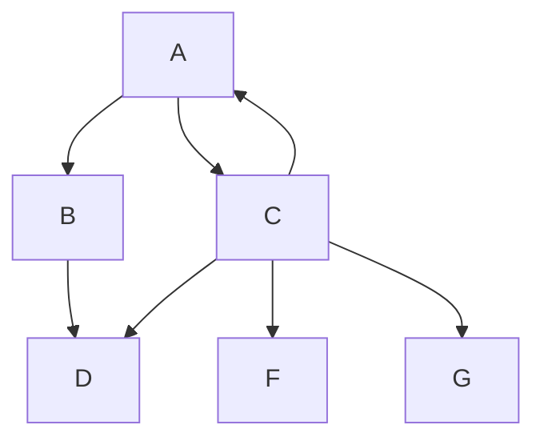

# Overview

Write a summary about the current page..

---

[TOC]


## Overview

Write something cool here..

## Some Features

### Code

You have inline code `highlight` as well

```csharp
class Fact 
{
    public void sayTruth()
    {
        Console.WriteLine("LaRecipe is cool");
    }
}
```

### Built-in Vue component

- Card

<larecipe-card shadow>
    Example card
</larecipe-card>

- Progress bar

<larecipe-progress type="success" :value="60"></larecipe-progress>

- Button 

<larecipe-button radius="full">Example button</larecipe-button>


<larecipe-card>
    Progress bar inside a card
    <larecipe-progress type="info" :value="100"></larecipe-progress>
</larecipe-card>


### Diagrams



### Alerts

> This is a simple alert

<br/>

{.danger}
> But you can make it scary

<br/>

{.success}
> Or nice


### Tables

| Product            | Price                        |
|:-------------------|:-----------------------------|
| Ice Cream          | AED 10                       |
| Pepsi              | AED 2.5                      |

### Checkbox list

- [x] This is done
- [ ] Todo
- [ ] Todo
