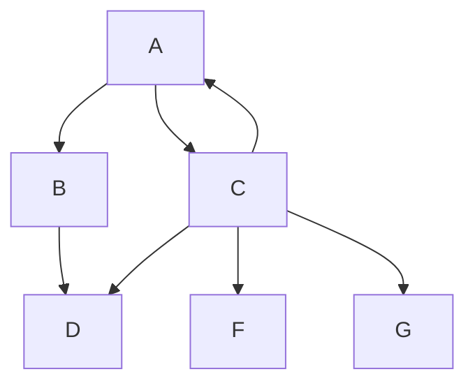

# Laravel Markdown Documentation

LaRecipe helps you write clean and beautiful documentation using Markdown for your software projects and keeping the docs within the source code.

---

[TOC]

## Overview



**LaRecipe** is simply  a code-driven package provides an easy way to create beautiful documentation like this for your product or application inside your Laravel app. However, the usage of LaRecipe is not limited to creating documentation only 😏. See an [example](/docs/{{version}}/example-project-tracking).

```php
echo 'LaRecipe is beautiful';
```

## Features

Inline code is `cool`


```js
echo 'LaRecipe is beautiful';
```


FinalMessageResolver | <larecipe-card><larecipe-badge type="success" circle class="mr-2" icon="fa fa-book">🚀</larecipe-badge> Yay! you saved AED 10 on delivery!<larecipe-progress type="success" :value="100"></larecipe-progress></larecipe-card>
:- | :-
0  | 1


<larecipe-card>
    <larecipe-badge type="success" circle class="mr-2" icon="fa fa-book"></larecipe-badge> Markdown Support
    <larecipe-progress type="success" :value="100"></larecipe-progress>
</larecipe-card>


## Credits

LaRecipe package uses internally some open-source third-party libraries/packages, many thanks to the web community:

+ [Laravel](https://laravel.com) - Open source full-stack framework.
+ [VueJs](https://vuejs.org) - The Progressive JavaScript Framework.
+ [TailwindCSS](https://tailwindcss.com) - A utility-first CSS framework for rapid UI development.
+ [erusev/parsedown-extra](https://github.com/erusev/parsedown-extra) - PHP markdown parser.
+ [symfony/dom-crawler](https://symfony.com) - Dom manipulation.
+ [phpunit/phpunit](https://phpunit.de) - PHP unit testing library.
+ [orchestra/testbench](https://github.com/orchestral/testbench) - Unit test package for Laravel packages.